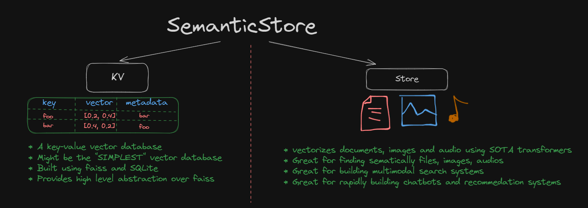
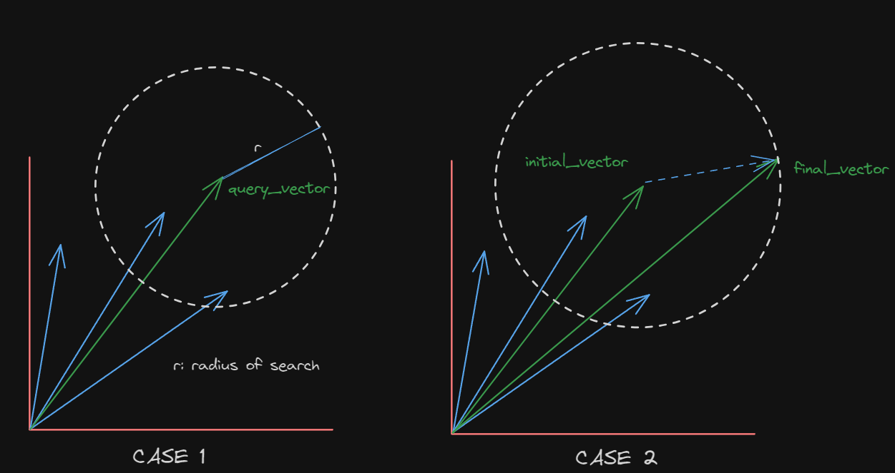

# SemanticStore

<p align="center">
    
   
    <a href="https://github.com/pragneshbarik/semantic-store/txtai">
        
    </a>
   
    <a href="https://github.com/pragneshbarik/semantic-store/txtai/issues">
        
    </a>
        

    
   
</p>

> LIBRARY IS HIGHLY EXPERIMENTAL, KV MIGHT BE WORKING FINE
> 


# What is SemanticStore




## Getting Started

Follow these steps to get started with the SemanticStore:

1. **Install into environment**

```python
pip install semantic-store
```
2. **Install requirements**
> Will try to package CLIP in next release version
```shell
pip install git+https://github.com/openai/CLIP.git
```

# Overview of KV

A simple Key Value vector database, built around faiss and SQLite, provides a pythonic interface for insertion, deletion, udating and deleting. It comes bundled with SemanticStore but if you want to install it as a standalone package then install it using this command,
```shell
pip install semantic-store-kv
```
 only requires numpy and faiss as additional requirements.

## Getting Started with KV

1. **CRUD Operations**

KV provides a similar interface to that of a python dictionary.  
```python
from semanticstore import KV

# IF PRESENT LOAD DB, ELSE CREATE NEW
kv = KV('path/of/data_base', n_dim = 2)

# CREATE
kv['foo'] = {'vector':[1.0, 3.4], 'metadata' : {'title' : 'hero'}}
kv['star'] = {'vector': [1.0, 1.0],'metadata': 'angel'}
kv[2] = {'vector': [3.0, 5.0],'metadata': [1, 2, 5]}

# READ
print(kv['foo'])
>> {'vector':[1.0, 3.4], 'metadata' : {'title' : 'hero'}}

# UPDATE
kv['foo'] = {'vector':[-1.0, -3.4], 'metadata' : {'subtitle' : 'villian'}}

# DELETE
kv.remove('foo')

# FIND
kv.find('bar')
>> False

# COMMIT
kv.commit() # Flush changes to disk

# CLOSE
kv.close() # Unlocks and frees the database 
```

2. **Vector Operations**
   
   KV provides these following vector operations
   
   **1. Nearest neighbor search:** Nearest neighbor search in a vector database is a specialized problem that deals with finding the nearest neighbors to a given query vector within a large database of vectors. 

<center>  
</center>

```python
# kv[query_vector][top_k]
kv[[1.0, 2.1]][2]

# Returns results in sorted according to distance
>> [{'key': 'star',
  'value': {'vector': [1.0, 1.0], 'metadata': 'angel'},
  'distance': 1.2099998},
 {'key': 'foo',
  'value': {'vector': [1.0, 3.4], 'metadata': {'title': 'hero'}},
  'distance': 1.6900005}]
```
Also supports slicing, might come handy sometimes. 
```python 
# kv[query_vector][offset : top_k]
kv[[1.0, 3.1]][1:2]

>> [{'key': 'star',
  'value': {'vector': [1.0, 1.0], 'metadata': 'angel'},
  'distance': 4.4099994}]
```

**2. Range Search:** Range search is a data retrieval or querying technique used in databases and data structures to find all data points or items that fall within a specified range or region in a multidimensional space. 

> Can be used in RAG and HyDE for limiting respnose of a LLM between two contexts.



```python
# CASE 1 : kv[query_vector : radius]
kv[[1.0, 2.1] : 5.0]

#  Results are not sorted
>> [{'key': 'foo',
  'value': {'vector': [1.0, 3.4], 'metadata': {'title': 'hero'}},
  'distance': 1.6900005},
  {'key': 'star',
  'value': {'vector': [1.0, 1.0], 'metadata': 'angel'},
  'distance': 1.2099998},
  {'key': '2',
  'value': {'vector': [3.0, 5.0], 'metadata': [1, 2, 5]},
  'distance': 12.410001}]
```

```python
# CASE 2 : kv[initial_vector : final_vector]
kv[[1.0, 2.1] : [3, 5]]

#  Results are not sorted
>> [{'key': 'foo',
  'value': {'vector': [1.0, 3.4], 'metadata': {'title': 'hero'}},
  'distance': 1.6900005},
  {'key': 'star',
  'value': {'vector': [1.0, 1.0], 'metadata': 'angel'},
  'distance': 1.2099998}]
```

# Overview of Store


## Features

- **Multimodal Support**: Handle a wide range of data types, including image, text, and audio vectors.
- **Faiss Integration**: Utilize the speed and efficiency of Faiss for similarity search.
- **Custom Pipelines**: Customizable pipelines for processing and indexing your data.


## Getting Started

Follow these steps to get started with the SemanticStore:

\
3. **Get started in python**

```python
from semanticstore import Store

store = Store()
store.connect('semantic.db')
store.insert('knowledge_base.txt')
store.commit()
res = store.search("what is meaning of life according to knowledge base ?", 5, modals=['text', 'image'])
print(res)
```

   ## Use cases
### 1. Search Engines
      

A flask server that serves semantic search results. 
```python
from flask import Flask, request, jsonify
from semanticstore import Store
store = Store()
store.connect('semantic.db')


# handles insertion of remote/network files, can be easily integrated with services like firebase, supabase.
store.insert('https://some/shutter/stock/image.jpeg')
store.insert('https://some/firebase/profile/photo.jpeg')
store.insert('https://some/remote/pdf.pdf')

@app.route("/search/<string:query>")
def recommend(query) :
   result = store.search(query=query, top_k = 5, modals=['image','text', 'audio'])
   search_results = []

   for image in results.images :
      search_results.append(image.file_path)
   
   for text in results.texts :
      search_results.append(text.file_path)
   
   for audio in results.audios :
      search_results.append(audio.file_path)
   
   return jsonify({'search_results' : search_results}) 

   ```
### 2. Building [RAG](https://research.ibm.com/blog/retrieval-augmented-generation-RAG) and [HyDE](https://wfhbrian.com/revolutionizing-search-how-hypothetical-document-embeddings-hyde-can-save-time-and-increase-productivity/) agents :
   
```python
# A simple RAG agent.
from semanticstore import Store
store = Store()
store.connect('semantic.db')

store.insert('some/notes.txt')
store.insert('some/lecture.mp3')
store.insert('some/research.pdf')

def LLM(prompt) :
   # Write your LLM connection and streaming logic here
   pass

query = input("Ask a query")
while query!="QUIT" :
    
    # handles retrival of most relevant chunks from inserted text and audio files
    query_results = store.search(query={query}, top_k=5, modals=['text', 'audio'])
    context = ' '.join(query_results.texts.chunks()) 
    context += ' '.join(query_results.audios.chunks()) 

    prompt = f"""
    GIVEN THIS CONTEXT : {context}

    ANSWER THE FOLLOWING QUERY : {query}

    """
    response = LLM(prompt)
    print(response)
    query = input()
   ```
### 3. Building Recommender Systems :

   A simple flask server that recommends similar images to the requested image.

```python
from flask import Flask, request, jsonify
from semanticstore import Store
store = Store()
store.connect('semantic.db')


# handles insertion of remote/network files, can be easily integrated with services like firebase, supabase.
store.insert('https://some/shutter/stock/image.jpeg')
store.insert('https://some/firebase/profile/photo.jpeg')

@app.route("/recommend/<string:image_url>")
def recommend(image_url) :
   # as of now only image to image search is working, will be adding more modalities. Try contributing
   result = store.multimodal_search(path=image_url, top_k = 5, modals=['image'])
   
   recommendations = []
   for image in results.images :
      recommendations.append(image.file_path)
   
   return jsonify({'recommendations' : recommendations})   
   ```

## Internal Architecture
To learn more click [here](https://whimsical.com/semantic-search-design-UzzALRbCvcUKqyPuGpAgeY@7YNFXnKbYjLguFP27KEEU)


* I need help in implementing the `remove` function. 

* If you are a senior and find this project interesting and have suggestions please mail me, suggestions will be greatly appreciated.


## Models
SemanticStore uses various state-of-the-art models to process text, images and audio.

| **Pipelines** |        **Model 1**        |        **Model 2**        |         **Model 3**         |         **Model 4**         |
|:-------------:|:-------------------------:|:-------------------------:|:---------------------------:|:---------------------------:|
| Text          | multi-qa-MiniLM-L6-cos-v1 |           _CLIP_          |              -              |              -              |
| Audio         |          Whisper          | multi-qa-MiniLM-L6-cos-v1 |            _CLIP_           |              -              |
| Image         |            CLIP           |           _BLIP_          | _multi-qa-MiniLM-L6-cos-v1_ |              -              |
| _Video_       |         _Whisper_         |           _CLIP_          |            _BLIP_           | _multi-qa-MiniLM-L6-cos-v1_ |

**Note** : Models and pipeines in _Italics_ are still to be implemented.


## Contributing
Contributions are welcome! If you'd like to enhance the SemanticStore or fix issues, please follow these steps:

1. Fork the repository.
2. Create a branch: git checkout -b feature/your-feature or fix/your-fix.
3. Commit your changes: git commit -m 'Add some feature' or git commit -m 'Fix some issue'.
4. Push to the branch: git push origin feature/your-feature or git push origin fix/your-fix.
5. Open a pull request


> **Note**: This vector store is intended for small hobby projects and personal use. It may not be suitable for large-scale or production environments.


