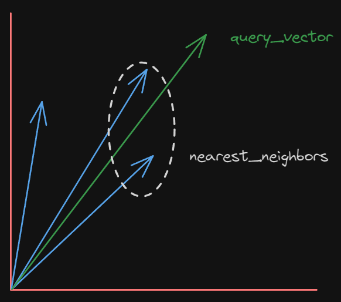

# SemanticStore

<p align="center">
    
   
    <a href="https://github.com/pragneshbarik/semantic-store/txtai">
        
    </a>
   
    <a href="https://github.com/pragneshbarik/semantic-store/txtai/issues">
        
    </a>
        

    
   
</p>


<p align="center">

</p>


# What is SemanticStore
A no non-sense Key-Value Vector database, built around faiss, provides a pythonic interface for insertion, deletion, updation and deletion.


## Getting Started

Follow these steps to get started with the SemanticStore:

1. **Install into environment**

```shell
pip install semantic-store
```
# Overview of KV

A no non-sense Key-Value Vector database, built around faiss, provides a pythonic interface for insertion, deletion, updation and deletion. Only requires numpy and faiss as additional requirements.

## Getting Started with KV

1. **CRUD Operations**

KV provides a similar interface to that of a python dictionary.  
```python
from semanticstore import KV

# IF PRESENT LOAD DB, ELSE CREATE NEW
kv = KV('path/of/data_base', num_dimensions = 2)
```
```py
# CREATE
kv['foo'] = {'vector':[1.0, 3.4], 'payload' : {'title' : 'hero'}}
kv['star'] = {'vector': [1.0, 1.0],'payload': 'angel'}
kv[2] = {'vector': [3.0, 5.0],'payload': [1, 2, 5]}
```
```py
# READ
print(kv['foo'])
>> {'vector':[1.0, 3.4], 'payload' : {'title' : 'hero'}}
```
```py
# UPDATE
kv['foo'] = {'vector':[-1.0, -3.4], 'payload' : {'subtitle' : 'villian'}}
```
```py
# DELETE
del kv['foo']
kv.remove('star')
```
```py
# FIND
kv.find('bar')
>> False
```
```py
# COMMIT
kv.commit() # Flush changes to disk
```
```py
# CLOSE
kv.close() # Unlocks and frees the database 
```

2. **Vector Operations**

KV provides these following vector operations

**1. Nearest neighbor search:** Nearest neighbor search in a vector database is a specialized problem that deals with finding the nearest neighbors to a given query vector within a large database of vectors. 

<p align="center">  
</p>

```python
# kv[query_vector][top_k]
kv[[1.0, 2.1]][2]

# OR

# kv.search(query, top_k)
kv.search(query=[1.0, 2.1], top_k=2)

# Returns results in sorted according to distance
>> [{'key': 'star',
  'value': {'vector': [1.0, 1.0], 'payload': 'angel'},
  'distance': 1.2099998},
 {'key': 'foo',
  'value': {'vector': [1.0, 3.4], 'payload': {'title': 'hero'}},
  'distance': 1.6900005}]
```
Also supports slicing, might come handy sometimes. 
```python 
# kv[query_vector][truncate_offset : top_k]
kv[[1.0, 3.1]][1:2]

>> [{'key': 'star',
  'value': {'vector': [1.0, 1.0], 'payload': 'angel'},
  'distance': 4.4099994}]
```

**2. Range Search:** Range search is a data retrieval or querying technique used in databases and data structures to find all data points or items that fall within a specified range or region in a multidimensional space. 

> Can be used in RAG and HyDE for limiting response of a LLM between two contexts.


```python
# CASE 1 : kv[query_vector : radius]
kv[[1.0, 2.1] : 5.0]

#  Results are not sorted
>> [{'key': 'foo',
  'value': {'vector': [1.0, 3.4], 'payload': {'title': 'hero'}},
  'distance': 1.6900005},
  {'key': 'star',
  'value': {'vector': [1.0, 1.0], 'payload': 'angel'},
  'distance': 1.2099998},
  {'key': '2',
  'value': {'vector': [3.0, 5.0], 'payload': [1, 2, 5]},
  'distance': 12.410001}]
```

```python
# CASE 2 : kv[initial_vector : final_vector]
kv[[1.0, 2.1] : [3, 5]]

#  Results are not sorted
>> [{'key': 'foo',
  'value': {'vector': [1.0, 3.4], 'payload': {'title': 'hero'}},
  'distance': 1.6900005},
  {'key': 'star',
  'value': {'vector': [1.0, 1.0], 'payload': 'angel'},
  'distance': 1.2099998}]
```

**3. Advanced data filtering:**  KV supports advanced data filtering using jmespath, allowing you to filter items based on specific criteria. Learn more about jmespath [here](https://jmespath.org/tutorial.html).

```python
# CASE 2 : kv[initial_vector : final_vector]
kv[[1.0, 2.1] : [3, 5]]

>> [{'key': 'foo',
  'value': {'vector': [1.0, 3.4], 'payload': {'title': 'hero'}},
  'distance': 1.6900005},
  {'key': 'star',
  'value': {'vector': [1.0, 1.0], 'payload': 'angel'},
  'distance': 1.2099998}]

kv[[1.0, 2.1] : [3, 5]].filter('[].payload.title')
>> 'hero'
```

You can chain multiple jmespath filters for granular control.

```py
kv.search(query, top_k).filter('<filter1>')
                       .filter('<filter2>')
                       .filter('<filter3>')
                       .fetch() # Fetch returns final search object.
```


## Contributing
Contributions are welcome! If you'd like to enhance the SemanticStore or fix issues, please follow these steps:

1. Fork the repository.
2. Create a branch: git checkout -b feature/your-feature or fix/your-fix.
3. Commit your changes: git commit -m 'Add some feature' or git commit -m 'Fix some issue'.
4. Push to the branch: git push origin feature/your-feature or git push origin fix/your-fix.
5. Open a pull request
